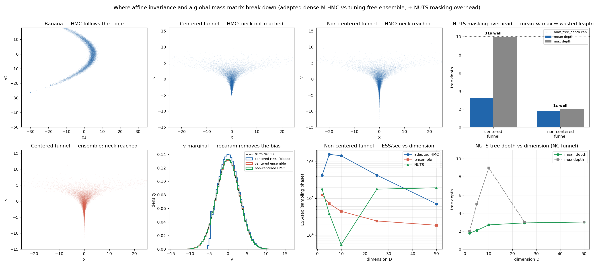

# mlxmc

**MCMC samplers in Apple [MLX](https://github.com/ml-explore/mlx).** A small,
gradient-aware sampler toolkit built directly on the MLX transform stack
(`grad` / `vmap` / `compile`), filling the "BlackJAX-shaped gap" — MLX has no
mature probabilistic-programming layer yet.

> **Status: exploratory research code.** The samplers work and are validated
> (exact moments on Gaussian targets, affine invariance proven empirically), but
> the interface is still flat modules rather than a stable package API. Expect churn.

## What's here

| Module | Sampler / tool |
|---|---|
| `ensemble_sampler.py` | Affine-invariant ensemble (Goodman & Weare 2010 — the `emcee` stretch move). Gradient-free, tuning-free. |
| `hmc.py` | Hamiltonian Monte Carlo, identity mass. `grad ∘ vmap` batched over chains. |
| `preconditioned_hmc.py` | Mass-matrix HMC (M = Σ⁻¹). |
| `warmup.py` | Stan-style warmup: dual-averaging step size + windowed **dense** mass-matrix estimation. |
| `nuts.py` | NUTS (multinomial; Hoffman & Gelman 2014), vectorized over chains. |
| `ess.py` | Effective sample size / integrated autocorrelation time (FFT + Sokal window); the cross-sampler **ESS/sec** metric. |
| `hard_targets.py` | Banana + centered / non-centered funnel benchmarks. |
| `plot_results.py` | Renders the benchmark figure. |
| `affine_invariance_test.py` | Empirical proof of affine invariance (same RNG → bit-identical acceptance under an affine map). |

## Why MLX

`grad`, `vmap`, `jvp`/`vjp`, and `compile` transfer almost directly from JAX,
with JAX-style functional RNG keys (`mx.random.split`). The wrinkles that shape
this code:

- **No traced control-flow primitives** (no `while_loop` / `scan` / `cond`). MLX
  is eager execution plus `compile` of *static* graphs. Fixed-length unrolled
  loops (leapfrog, fixed-`L` HMC) compile fine; data-dependent trajectory length
  (NUTS) is the hard case — `nuts.py` runs every chain to a fixed `max_tree_depth`
  and **masks** finished chains.
- **fp32 on the GPU.** Apple Metal has no fp64 in hardware (MLX has fp64 only on
  the CPU backend). This is fine for sampling — Monte Carlo error (~1/√ESS) swamps
  fp32 roundoff (~1e-6) — but ill-conditioned linear algebra (covariance, Cholesky
  in warmup) is kept host-side in numpy fp64; only the leapfrog runs on the GPU.

## Install

This is a [pixi](https://pixi.sh) project:

```bash
pixi install
pixi run python hmc.py            # run any module directly
pixi run python nuts.py funnel    # several have demo modes
```

## Usage

Every sampler takes a single-point log-density `logp_single(x) -> scalar` for
`x` of shape `(D,)`; batching over walkers/chains is handled internally with
`vmap`. Positions are MLX arrays of shape `(n_chains, D)`.

```python
import mlx.core as mx
import numpy as np

# Target: a strongly correlated 2-D Gaussian (corr 0.9, 25:1 variance ratio).
mu = mx.array([1.0, -2.0])
Sig_inv = mx.array(np.linalg.inv([[25.0, 4.5], [4.5, 1.0]]))

def logp_single(x):                       # x: (D,) -> scalar
    d = x - mu
    return -0.5 * (d @ Sig_inv @ d)

key = mx.random.key(0)
```

**Gradient-free ensemble** — no tuning, handles the ill-conditioning for free:

```python
from ensemble_sampler import run

key, k = mx.random.split(key)
ensemble = mx.random.normal(shape=(2000, 2), key=k) * 5.0     # (n_walkers, D)
samples, accept_frac = run(logp_single, ensemble, n_steps=3000, burn=1000, key=key)
```

**HMC, hand-tuned**, and **NUTS after Stan-style warmup** (same `logp_single`):

```python
from hmc import run_hmc
from warmup import warmup
from nuts import run_nuts

key, k = mx.random.split(key)
q0 = mx.random.normal(shape=(1000, 2), key=k) * 5.0           # (n_chains, D)

samples, acc = run_hmc(logp_single, q0, n_steps=1500, burn=500,
                       eps=0.15, n_leap=40, key=key)

# Warmup adapts (eps, dense M); NUTS then adapts trajectory length itself.
q_last, eps, Minv = warmup(logp_single, q0, n_warmup=600, n_leap=8, key=key)
chain, mean_depth, max_depth = run_nuts(logp_single, q_last, n_samples=1500,
                                        eps=eps, Minv_np=Minv, key=key)
```

## Findings



Validated on a corr-0.9, 25:1-variance Gaussian and on banana / funnel targets
(full notes in [`CLAUDE.md`](CLAUDE.md)):

- **Affine-invariant ensemble** is the robust low-D default: gradient-free,
  tuning-free, handles ill-conditioning for free (acceptance is bit-identical
  under an affine map). But weaker per-step mixing and it degrades with dimension.
- **HMC** needs gradients and a tuned `eps`/`L`, but mixes far better
  (τ≈2 vs ≈26). A **warmup-adapted dense mass matrix** recovers the true Σ to
  <1% Frobenius error and buys ~7–11× the ESS/sec — HMC's version of affine
  invariance, earned rather than supplied.
- **NUTS** is validated exact on the Gaussian (recovered covariance 24.97 vs 25)
  and auto-tunes trajectory length, but vectorized NUTS pays a real masking cost
  when trajectory lengths are heterogeneous (the funnel mouth/neck).
- **Geometry matters more than the sampler:** on the *centered* funnel the
  gradient-free ensemble beats a global-metric HMC, because a constant mass matrix
  is wrong everywhere when the scale is position-dependent; a **non-centered
  reparametrization** removes the geometry and makes HMC unbiased again.
- **ESS/sec is the honest efficiency metric** — acceptance fraction is a
  misleading proxy.

## References

- Goodman & Weare (2010), *Ensemble samplers with affine invariance.*
- Hoffman & Gelman (2014), *The No-U-Turn Sampler.*
- Betancourt (2017), *A Conceptual Introduction to Hamiltonian Monte Carlo.*

## License

[BSD-3-Clause](LICENSE).
